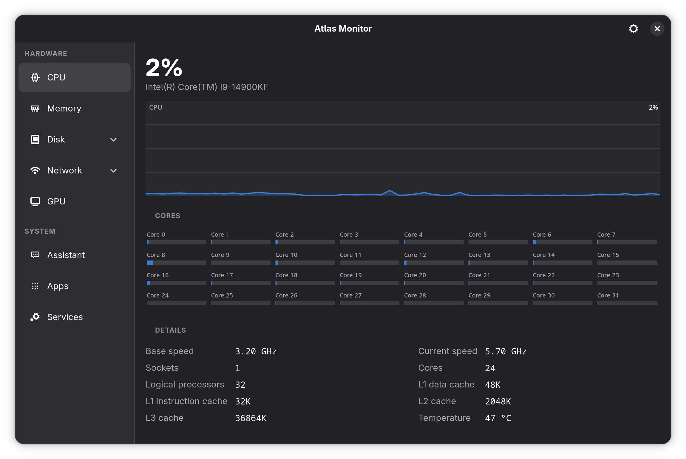
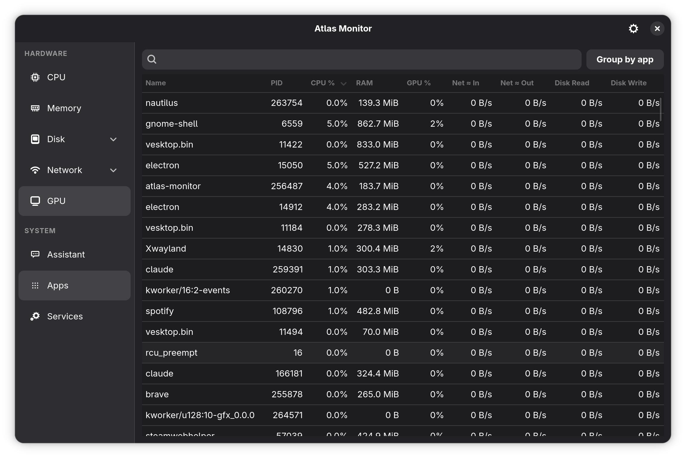
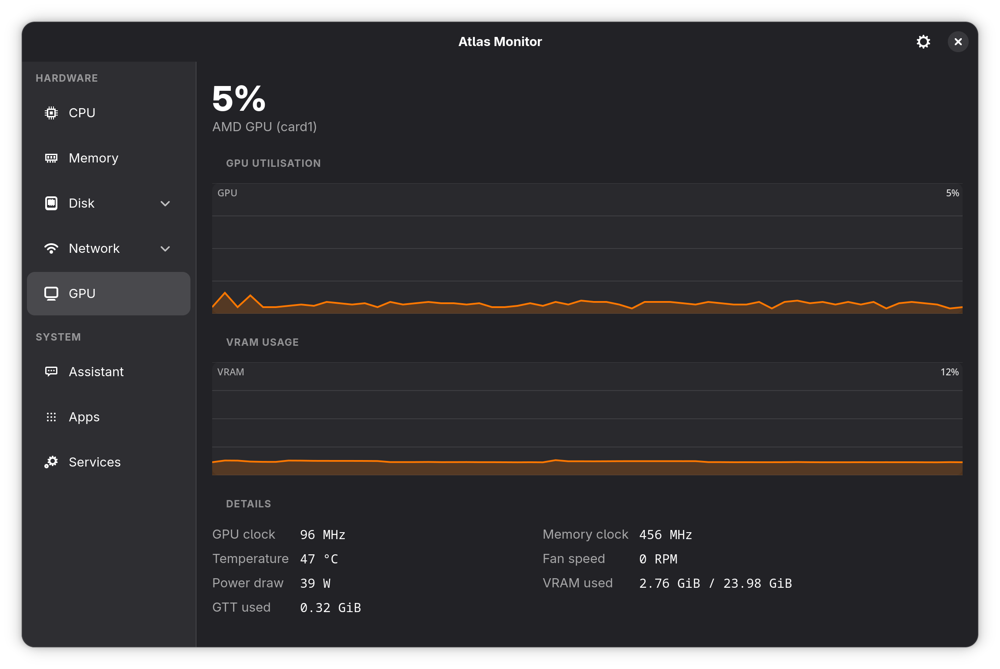
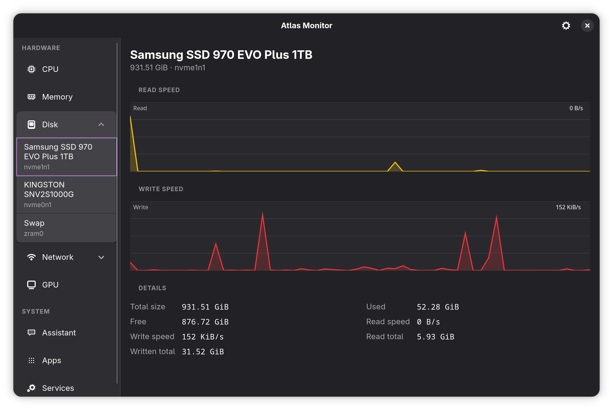
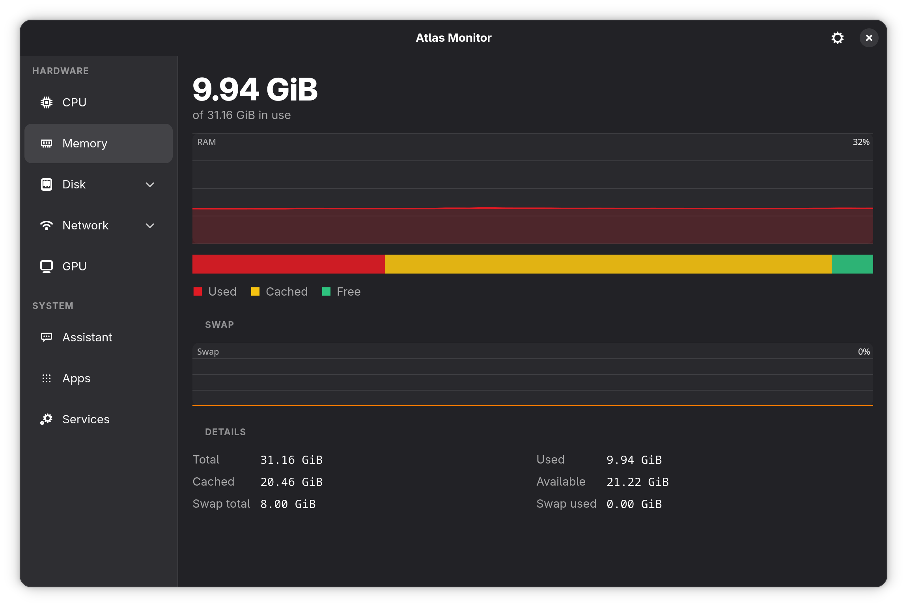
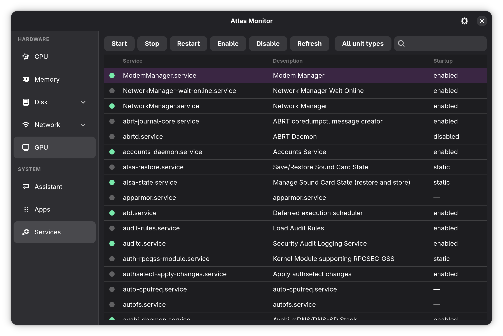

# Atlas Monitor — Minimal

[](https://github.com/EternalCoder454/atlas-monitor/actions/workflows/ci.yml)

A native Linux system monitor for GNOME / Fedora, written in Go with GTK4 and
libadwaita. It is a lighter-weight alternative to Mission Center with a fixed
two-pane layout (the sidebar never overlaps the content) and first-class AMD GPU
support read straight from sysfs.

**This is the `minimal` branch: the monitor, and nothing else.** The AI
assistant, its Ollama client, the quick prompts and the Markdown renderer are
not compiled out here — they are gone, along with the settings that configured
them and the dependency on `internal/ai`. If you want them, use `main`.

## Screenshots



<table>
  <tr>
    <td width="50%"><br><sub><b>Apps</b> — sortable process table with per-process CPU, RAM, GPU, network and disk</sub></td>
  </tr>
  <tr>
    <td width="50%"><br><sub><b>GPU</b> — AMD utilisation, VRAM, clocks, temperature and power, from sysfs</sub></td>
    <td width="50%"><br><sub><b>Disk</b> — drives by hardware model (primary first); zram shown as Swap</sub></td>
  </tr>
  <tr>
    <td width="50%"><br><sub><b>Memory</b> — RAM/swap history with a Used/Cached/Free breakdown</sub></td>
    <td width="50%"><br><sub><b>Services</b> — systemd units over D-Bus with start/stop/enable</sub></td>
  </tr>
</table>

## Quick install

Fedora (one line — installs build deps, then clones, builds and installs to
`~/.local`):

```sh
sudo dnf install -y golang gtk4-devel libadwaita-devel glib2-devel gcc pkgconf-pkg-config git && \
  git clone https://github.com/EternalCoder454/atlas-monitor.git && \
  cd atlas-monitor && make install
```

Arch Linux (builds a real package and hands it to pacman — `makepkg` clones the
branch itself):

```sh
sudo pacman -S --needed base-devel go gtk4 libadwaita git && \
  curl -O https://raw.githubusercontent.com/EternalCoder454/atlas-monitor/minimal/packaging/PKGBUILD && \
  makepkg -si
```

It installs as `atlas-monitor-minimal` and conflicts with the full
`atlas-monitor` package, since both provide the same binary.

Then press **Super** and search "Atlas". The first build compiles the gotk4 cgo
bindings and can take a few minutes; rebuilds are cached and fast.

## Features

- **Fixed two-pane layout** — a 200px sidebar that is always visible beside the
  content area, at any window size.
- **CPU** — live utilisation graph, per-core usage bars, frequencies, cache
  sizes, socket/core counts, and temperature (`coretemp`/`k10temp`).
- **Memory** — RAM and swap history, a Used/Cached/Free breakdown bar, and the
  full `/proc/meminfo`-derived figures.
- **Disk** (per device) — listed by hardware model (e.g. *Samsung SSD 970 EVO
  Plus 1TB*); read/write throughput graphs plus capacity and totals. The zram
  device is shown as **Swap** with a one-line explanation of what it is.
- **Network** (per interface) — download/upload graphs, addresses, MAC, and link
  speed.
- **GPU** — utilisation and VRAM graphs, clocks, temperature, fan and power for
  AMD, NVIDIA and Intel. AMD comes straight from sysfs, NVIDIA through NVML
  loaded at runtime (the driver is never a build dependency), and anything else
  through the generic DRM interfaces. No ROCm, no nvtop, no vendor SDK.
- **Battery** — charge and power-draw graphs, time remaining, pack health
  against its design capacity, charge cycles and adapter state. The page only
  appears on machines that have a battery.
- **Apps** — a virtualised process table (`GtkColumnView`) with click-to-sort
  columns, live search, a right-click menu (End Task / Kill / Stop / Continue /
  Open file location), and *Group by app*. A **Power** column rates each process
  Very low → High the way Task Manager does, and kernel worker threads — about
  three quarters of `/proc` — are hidden behind a toggle.
- **Services** — systemd units over D-Bus with status dots and
  Start/Stop/Restart/Enable/Disable actions (polkit-authenticated).

## Performance

Atlas is meant to be the cheapest thing running on your desktop. Resident memory,
measured on a Fedora 44 / KDE Wayland box with ~700 processes:

| | 0.5.0 | 0.6.0 |
|---|---|---|
| CPU view, just opened | 128 MiB | **87 MiB** |
| Apps process table open | 152 MiB | **103 MiB** |
| after visiting every page | 156 MiB | **107 MiB** |
| after 150 Services refreshes | 601 MiB | no growth |

(that last row was a leak — see below. The binary also went from 17.7 MB to
14.3 MB, and the thread count from ~34 to ~16.)

Those are RSS, the figure a task manager shows, each pair measured back to back
on the same machine. Proportional set size — Atlas's actual share of physical
RAM once pages shared with other apps are divided up — went from 104 MiB to
80 MiB after touring every page.

CPU and I/O, measured the same way over a 30-second steady-state window:

| | 0.6.1 | now |
|---|---|---|
| idle page — CPU | 5.2 ms/s | **2.4 ms/s** |
| idle page — read syscalls | 93/s | **47/s** |
| Apps page — CPU | 22.4 ms/s | **14.8 ms/s** |
| Apps page — read syscalls | 2606/s | **862/s** |

Profiling said 90% of the app's CPU was syscalls, not computation, so that is
what the work went after:

- **Kernel files are held open.** `/proc/stat`, `/proc/meminfo`, the per-core
  frequencies, the GPU's counters — all of them are re-read from a descriptor
  that stays open, because procfs and sysfs regenerate a file's contents on each
  read. That is one syscall where `os.ReadFile` was four, and 20× faster per
  attribute with no allocation (`internal/sysfs`).
- **The process scan opens far less.** Per-process files are opened with
  `openat` against a descriptor held on `/proc`, read once rather than twice —
  procfs returns a whole file in one read, so looping until EOF doubled the
  syscalls — and kernel threads are dropped the moment the stat line identifies
  one, before anything else is opened for them.
- **One walk of each process's descriptors**, not two. The socket count and the
  per-process GPU counters both come from `/proc/<pid>/fd`; they used to walk it
  separately. New processes are checked for GPU handles immediately, so a game
  shows its load on the first tick after it launches, and the full sweep of
  every process became a rare safety net instead of a five-second cycle.
- **statfs runs outside the lock.** Measuring free space can block for as long
  as the filesystem takes to answer — indefinitely on a network mount whose
  server has gone — and it used to do that while holding the lock every reader
  needs, which meant the whole window. It is also only re-measured every fifth
  tick; capacity does not move like throughput does.

Where the rest comes from:

- **The window is drawn on the CPU by default.** GTK's GPU renderers load the
  whole Mesa stack — on an AMD box that is `libgallium` plus a 150 MB
  `libLLVM`, and the Vulkan loader additionally opens *every* installed driver,
  including lavapipe and the Direct3D translation layer. That is ~60 MiB of
  resident memory to draw a few line charts once a second. **Settings → App →
  Rendering** switches to GPU (Vulkan, restricted to your card's driver) if you
  prefer smoother resizing on a high-refresh display.
- **Pages are built the first time you open them.** A machine with three disks
  and three interfaces has a dozen pages; Atlas builds the one you are looking
  at.
- **Nothing is redrawn that has not changed.** Every live value remembers the
  text it last pushed, so a steady reading costs no formatting, no Go→C string
  copy and no Pango relayout. Per-tick allocation in the collectors and the
  process table is essentially zero.
- **The C heap is kept honest.** glibc is configured for a small long-running
  GUI process (capped arenas, prompt trimming) and idle memory is handed back
  once a minute — and immediately when the window is hidden.
- **No `net/http`, and nothing that pulls it in.** `crypto/tls`, `crypto/x509`
  and the FIPS module — a 32 MiB static buffer among them — are not in the
  binary at all. Atlas itself never opens a socket; the optional update check
  shells out to `git`, which does its own networking and can be switched off.
- **The process table shows processes.** Kernel worker threads are roughly three
  quarters of `/proc` and there is nothing you can do with them, so they start
  hidden — which also cuts the widgets GTK realises for the table by about the
  same proportion, worth ~8 MiB.
- **Tables are merged, not replaced.** Both the process list and the systemd
  unit list keep a stable row object per entry and update it in place. Replacing
  a GTK list model wholesale makes it tear down and rebuild every realised row,
  and that memory is never given back — refreshing the Services list once a
  second used to take the process past 600 MiB in two and a half minutes.
- Collection **pauses entirely while the window is hidden/minimised** (0% CPU),
  and the expensive per-process scan only runs while the Apps page is open.
- Graphs use fixed 60-sample ring buffers, pre-allocated at startup. The
  **refresh interval** is configurable (1–10 seconds); a slower rate costs less
  CPU and stretches the same 60 samples over a longer window.

## Install without building

Each release carries a prebuilt tarball. It needs the GTK4 runtime libraries
(not the `-devel` packages) and no Go toolchain:

```sh
sudo dnf install gtk4 libadwaita        # Debian: libgtk-4-1 libadwaita-1-0
tar xf atlas-monitor-*-linux-x86_64-fedora*.tar.gz
cd atlas-monitor-* && ./install.sh      # --system for /usr/local, --uninstall to remove
```

The binary is dynamically linked, so the tarball is built per Fedora release —
pick the one matching yours, or build from source below. `install.sh` checks
what the dynamic linker cannot resolve and says so before installing anything.

Arch Linux has a [`PKGBUILD`](packaging/PKGBUILD). `makepkg -si` from
`packaging/` builds the released version and installs it through pacman, so
`pacman -R atlas-monitor` removes it cleanly and updates arrive the same way as
every other package. The in-app updater stands down for a packaged install —
it needs a source checkout to pull and rebuild, notices there is none, and says
so rather than half-working.

An RPM spec lives in [`packaging/`](packaging/atlas-monitor.spec) for COPR or a
local `rpmbuild`.

## Build dependencies

Fedora 40+/44:

```sh
sudo dnf install golang gtk4-devel libadwaita-devel glib2-devel gcc pkgconf-pkg-config
```

Arch Linux:

```sh
sudo pacman -S --needed base-devel go gtk4 libadwaita
```

You need Go 1.22 or newer. The first build compiles the gotk4 cgo bindings and
can take several minutes; subsequent builds are cached and fast.

## Build & install

```sh
make            # build ./bin/atlas-monitor
make run        # build and run
make install    # install to ~/.local/bin and the stylesheet to
                # ~/.local/share/atlas-monitor/
make test       # go test ./...
make clean
```

`make install` honours `PREFIX` (default `~/.local`).

## Updating

Open **Settings** (the gear) → **Application** and click **Update and restart**.
Atlas pulls the latest version of the selected **Update channel** from GitHub,
rebuilds, and relaunches:

- **Release (main)** — the stable `main` branch (the default).
- **Beta (beta)** — the newest features and fixes, for trying things early.

The pull is fast-forward only and is skipped entirely if the source checkout has
local changes, so a tree you are editing is never overwritten.

## Notes

- **GPU**: the most capable card is picked automatically. AMD is read from
  `/sys/class/drm/card*/` and the `amdgpu` hwmon node; NVIDIA through NVML,
  which is `dlopen`ed at runtime so a machine without the proprietary driver
  simply falls through; everything else — Intel, nouveau — through hwmon for
  temperature, fan and power plus the kernel's per-client `drm-engine-*`
  counters for utilisation. The card is named from the system PCI database when
  `hwdata` is installed. No ROCm or vendor SDK is required.
- **Battery**: read from `/sys/class/power_supply`, normalising the two shapes
  firmware uses (watt-hours with a wattage, or amp-hours with a current and a
  voltage) to the same figures. Multiple packs are summed. The **Power** column
  in Apps is a weighted blend of CPU, GPU and I/O activity, not a measurement:
  Linux exposes package energy through RAPL but nothing per process, so — as on
  Windows — it is a rating rather than a reading.
- **Per-process network** is an estimate — exact per-process byte counts are not
  exposed by the kernel without elevated privileges, so interface throughput is
  attributed across processes by their open-socket count. These columns are
  labelled **Net ≈** to make the approximation explicit.
- **Per-process GPU** is read from the DRM fdinfo interface
  (`/proc/<pid>/fdinfo`, the `drm-engine-*` nanosecond counters), so each
  process's GPU engine load is shown — no root or debugfs required. Known GPU
  clients are sampled every tick with a periodic full rescan to find new ones.
- **Rendering**: the GSK renderer is chosen from **Settings → App →
  Rendering** and applied at startup. Setting `GSK_RENDERER` or `GDK_DISABLE`
  in the environment yourself always wins — Atlas never overrides a variable
  you have set.
- **Services**: Start/Stop/Restart/Enable/Disable are performed through systemd
  over the system bus, which triggers your desktop's polkit agent for
  authentication. Without authorisation the action returns an error shown in the
  view.
- **Nothing leaves the machine.** There is no network client in this build. The
  only outbound request Atlas can make at all is the optional update check,
  which asks GitHub whether a newer version exists and can be turned off in
  **Settings**. Settings persist to `~/.config/atlas-monitor/settings.json`.

## Development

- `make vet`, `make test` and `make test-race` mirror what CI runs.
- The non-GUI layers have integration tests that read this machine's live
  `/proc`, `/sys`, and D-Bus:
  `go test ./internal/stats/ ./internal/process/ ./internal/services/ -v`.
- `ATLAS_VIEW=<name>` opens a specific view at startup (e.g. `apps`,
  `services`, `gpu`, `power`, `memory`, `disk:nvme0n1`, `net:wlp7s0`) — handy
  for testing, and it overrides the remembered page.
- CI runs build, `vet`, `gofmt`, the tests and the race detector on a Fedora
  container ([`.github/workflows/ci.yml`](.github/workflows/ci.yml)).

## Versioning

Atlas Monitor follows [Semantic Versioning](https://semver.org):
`MAJOR.MINOR.PATCH`.

- **MAJOR** — large or breaking changes.
- **MINOR** — new, backward-compatible features.
- **PATCH** — backward-compatible bugfixes.

`0.x` releases are pre-1.0 (the app is still evolving); `1.0.0` will mark the
first release declared stable. The current version lives in [`VERSION`](VERSION)
and is shown in **Settings → Application → Version**.

Tagged releases land on `main` (e.g. `v0.1.0`). Day-to-day development happens on
the `beta` branch (versioned `X.Y.Z-beta`); once a beta is approved it is merged
to `main`, the `-beta` suffix dropped, and the release tagged.

## Project layout

```
main.go                embeds the stylesheet, starts the app
internal/app/          AdwApplication, window, two-pane wiring
internal/ui/           sidebar, content stack, the individual views
internal/stats/        /proc + /sys collectors, ring buffers, pause/resume
internal/process/      per-process /proc/[pid] collection
internal/gpu/          GPU readers: amdgpu sysfs, NVIDIA NVML, generic DRM
internal/power/        battery and AC adapter from /sys/class/power_supply
internal/services/     systemd D-Bus client
internal/gfx/          renderer selection; keeps the GPU driver stack out
internal/sysmem/       C allocator tuning and returning idle memory to the OS
internal/config/       persisted user settings (~/.config/atlas-monitor)
internal/graph/        reusable Cairo graph widget
internal/format/       byte/rate/clock formatting helpers
internal/sysfs/        /proc and /sys files held open and re-read with pread
assets/style.css       theme-aware styling
```
