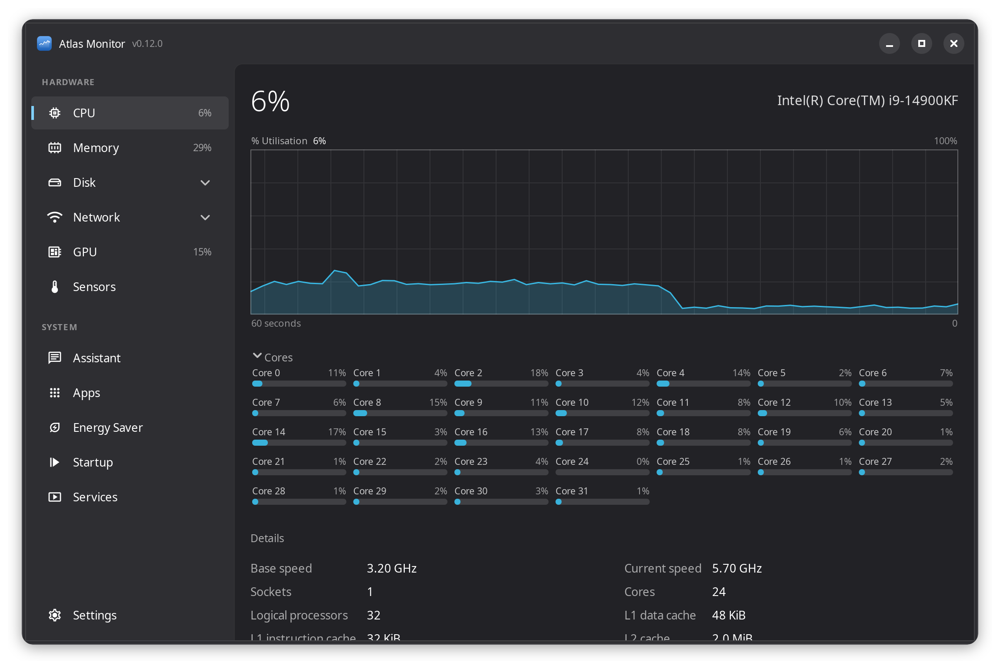
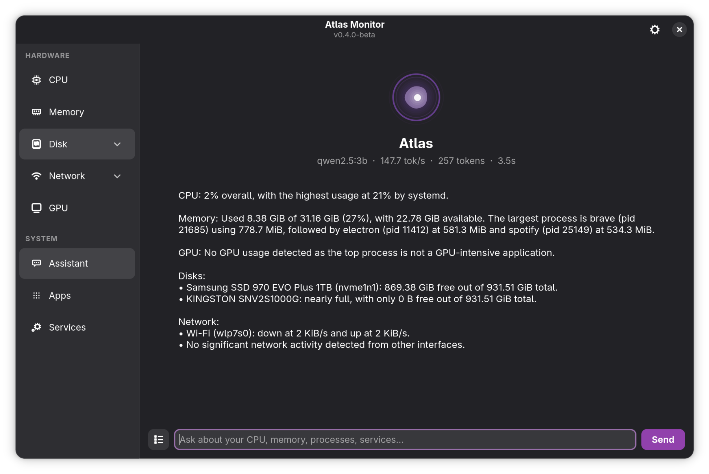
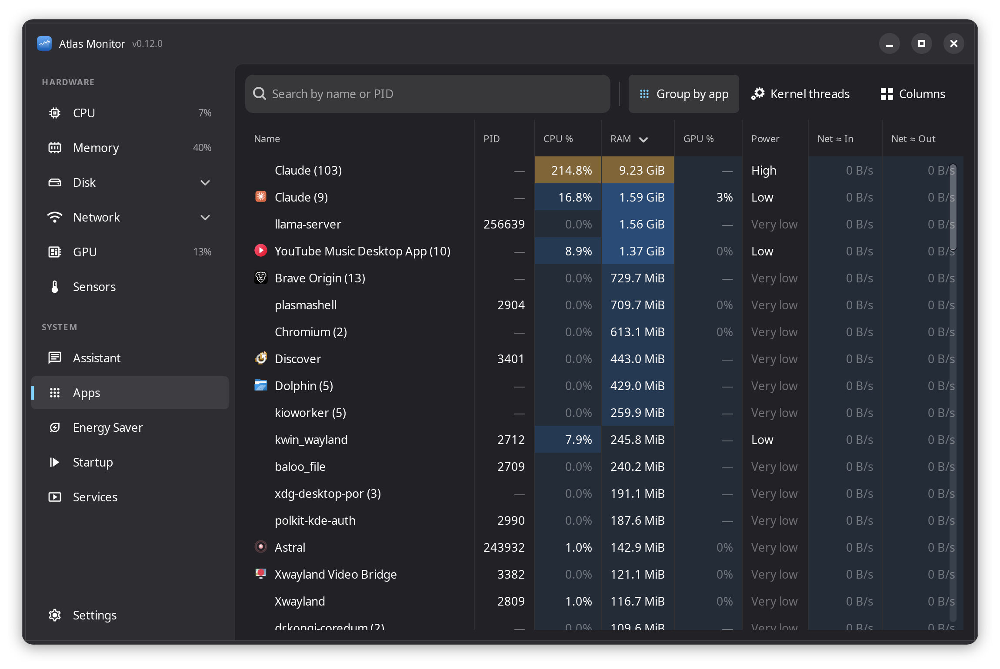
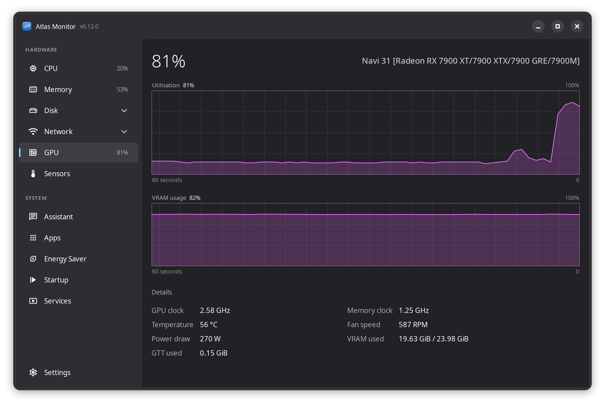
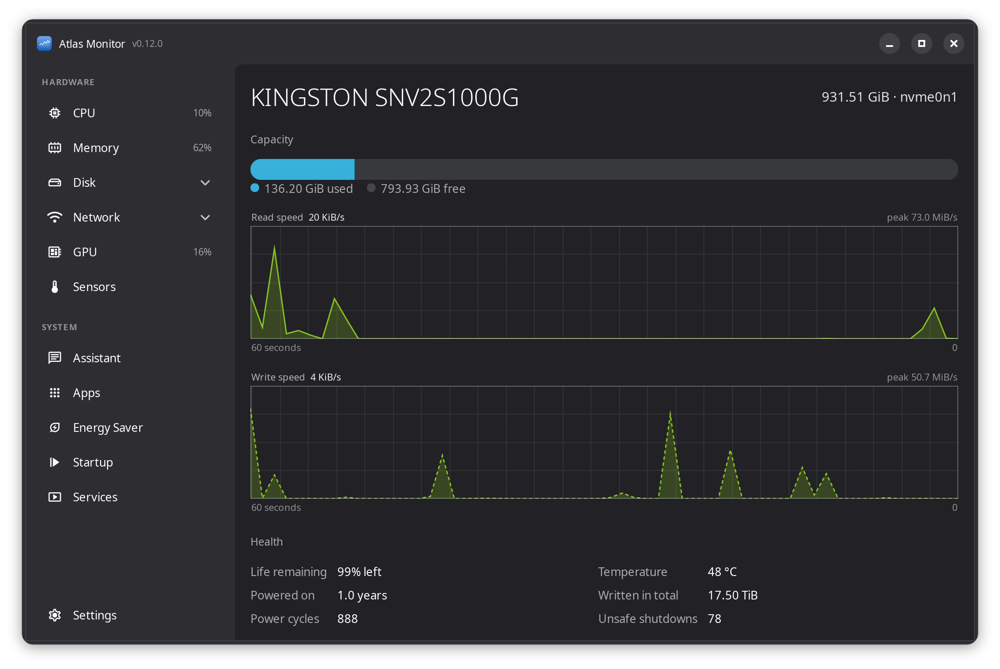
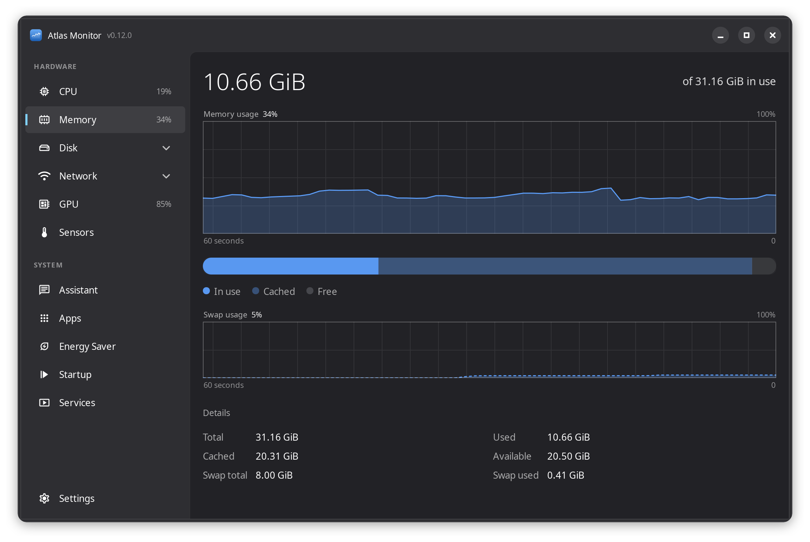
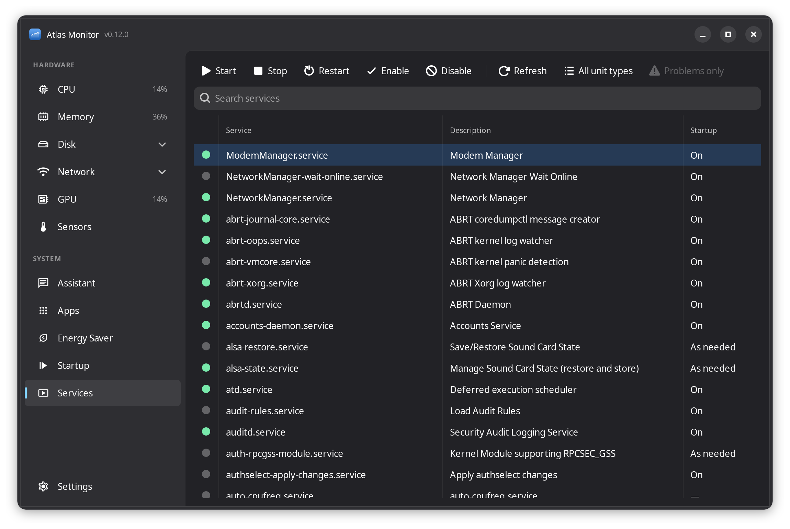

# Atlas Monitor

[](https://github.com/EternalCoder454/atlas-monitor/actions/workflows/ci.yml)

A system monitor written in Go with GTK4 and libadwaita. It is a lighter-weight
alternative to Mission Center with a fixed two-pane layout (the sidebar never
overlaps the content) and first-class AMD GPU support read straight from sysfs.

Linux is where it is developed and where everything works. There is a
[Windows build](#windows) too, which covers the processor, memory, disks,
network, processes, services, startup entries and battery — see that section for
what it cannot do and why.

## Screenshots



<table>
  <tr>
    <td width="50%"><br><sub><b>Assistant</b> — a local Ollama model answering from live system context, rendered Markdown with tokens/sec</sub></td>
    <td width="50%"><br><sub><b>Apps</b> — sortable process table with per-process CPU, RAM, GPU, network and disk</sub></td>
  </tr>
  <tr>
    <td width="50%"><br><sub><b>GPU</b> — AMD utilisation, VRAM, clocks, temperature and power, from sysfs</sub></td>
    <td width="50%"><br><sub><b>Disk</b> — drives by hardware model (primary first); zram shown as Swap</sub></td>
  </tr>
  <tr>
    <td width="50%"><br><sub><b>Memory</b> — RAM/swap history with a Used/Cached/Free breakdown</sub></td>
    <td width="50%"><br><sub><b>Services</b> — systemd units over D-Bus with start/stop/enable</sub></td>
  </tr>
</table>

## Install

One line, on any Linux distribution:

```sh
curl -fsSL https://raw.githubusercontent.com/EternalCoder454/atlas-monitor/main/setup.sh | bash
```

It installs what the build needs with your own package manager (it shows you
the command and asks first), builds Atlas and puts it in your app menu: press
**Super** and search "Atlas". Nothing is written outside your home folder except
through your package manager. The first build takes a few minutes.

Atlas is built against GTK 4.22 and libadwaita 1.9. Where your distribution has
those, it is built with your own packages; where it has older ones, `setup.sh`
builds and runs it in a small Fedora container instead, through
[distrobox](https://distrobox.it). The container shares your home, your
processes and your desktop, so Atlas still sees the whole machine, and it opens
from the app menu like anything else.

| Distribution | How `setup.sh` installs Atlas |
| --- | --- |
| Fedora 44 and later | Natively (dnf) |
| Arch Linux, Manjaro, EndeavourOS, CachyOS | Natively (pacman), or with the [PKGBUILD](#arch-linux) |
| openSUSE Tumbleweed | Natively (zypper) |
| Ubuntu 26.04 and later, Linux Mint 23 and later | Natively (apt) |
| Debian testing (forky) and unstable | Natively (apt) |
| Void, Alpine, Solus and others | Natively (xbps, apk, eopkg) if their GTK is 4.22 or newer, otherwise in a container |
| Debian 13, Ubuntu 24.04 and 25.x, Linux Mint 22, Pop!_OS, elementary OS | In a Fedora container (their GTK is older than 4.22) |

Options go after `bash -s --`: `--beta` follows the Beta channel, `--minimal`
installs the build without the assistant, `--yes` answers yes to every question,
and `--container` or `--native` choose the route yourself.

```sh
curl -fsSL https://raw.githubusercontent.com/EternalCoder454/atlas-monitor/main/setup.sh | bash -s -- --beta
```

**Update:** the **Update** button in Settings, or

```sh
bash ~/.local/share/atlas-monitor/setup.sh update
```

**Uninstall:** close Atlas first, then

```sh
bash ~/.local/share/atlas-monitor/setup.sh uninstall            # keeps your settings
bash ~/.local/share/atlas-monitor/setup.sh uninstall --purge    # removes them too
```

`bash setup.sh check` says what your system has, what it is missing and which
route it would take, without changing anything.

## Features

- **Fixed two-pane layout** — a 200px sidebar that is always visible beside the
  content area, at any window size.
- **CPU** — live utilisation graph, per-core usage bars, frequencies, cache
  sizes, socket/core counts, and temperature (`coretemp`/`k10temp`).
- **Memory** — RAM and swap history, a Used/Cached/Free breakdown bar, and the
  full `/proc/meminfo`-derived figures.
- **Disk** (per device) — listed by hardware model (e.g. *Samsung SSD 970 EVO
  Plus 1TB*); read/write throughput graphs plus capacity and totals. The zram
  device is shown as **Swap** with a one-line explanation of what it is.
- **Network** (per interface) — download/upload graphs, addresses, MAC, and link
  speed.
- **GPU** — utilisation and VRAM graphs, clocks, temperature, fan and power for
  AMD, NVIDIA and Intel. AMD comes straight from sysfs, NVIDIA through NVML
  loaded at runtime (the driver is never a build dependency), and anything else
  through the generic DRM interfaces. No ROCm, no nvtop, no vendor SDK.
- **Battery** — charge and power-draw graphs, time remaining, pack health
  against its design capacity, charge cycles and adapter state. The page only
  appears on machines that have a battery.
- **Sensors** — every temperature, fan, voltage and power reading the hardware
  offers through hwmon, named for what it is rather than by driver: each drive
  by its model, each memory module by its slot, the graphics card's edge,
  hotspot and memory temperatures, the network adapters, the motherboard. The
  CPU's per-core temperatures fold away behind the package reading.
- **Apps** — a virtualised process table (`GtkColumnView`) with click-to-sort
  columns, live search, a right-click menu (Details / End Task / Kill / Stop /
  Continue / Open file location), and *Group by app*. Grouping is by the
  application a process really belongs to — the systemd unit the desktop starts
  it in — so Firefox's dozen processes are one row called Firefox, with its icon,
  and End Task on it ends all of them. A **Power** column rates each process
  Very low → High the way Task Manager does, and kernel worker threads — about
  three quarters of `/proc` — are hidden behind a toggle.
- **Details** — double-click a process for what the table cannot say: its
  command line, what started it, who owns it, when, its threads and open files,
  and its memory three ways (resident, proportional, private). For a grouped
  application, its processes, each one a click away.
- **Energy Saver** — the programs working hardest, and a way to put one behind
  the rest. With *Ease off busy apps automatically* on, an app that keeps a core
  busy for half a minute is eased by itself and put back when it calms down. It
  is done through the app's CPU weight, which is reversible and applies to every
  process the app has; it only matters when something else wants the processor;
  and anything playing or recording sound, the app you are using, and terminals
  are left alone. Everything eased automatically is put back when Atlas closes,
  and after a crash, the next time it starts.
- **Services** — systemd units over D-Bus with status dots and
  Start/Stop/Restart/Enable/Disable actions (polkit-authenticated).
- **Assistant** — an optional local AI (via [Ollama](https://ollama.com)) that
  answers questions about your machine — specs, the top CPU/memory processes,
  failed services — from a live system snapshot. A dropdown beside the message
  box offers editable **quick prompts** (Detailed Overview, Top Processes, Quick
  Check). Toggle it off any time in **Settings** (the last entry in the sidebar).

## Performance

Atlas is meant to be the cheapest thing running on your desktop. Resident memory,
measured on a Fedora 44 / KDE Wayland box with ~700 processes:

| | 0.5.0 | 0.6.0 |
|---|---|---|
| CPU view, just opened | 128 MiB | **87 MiB** |
| Apps process table open | 152 MiB | **103 MiB** |
| after visiting every page | 156 MiB | **107 MiB** |
| after 150 Services refreshes | 601 MiB | no growth |

(that last row was a leak — see below. The binary also went from 17.7 MB to
14.3 MB, and the thread count from ~34 to ~16.)

Those are RSS, the figure a task manager shows, each pair measured back to back
on the same machine. Proportional set size — Atlas's actual share of physical
RAM once pages shared with other apps are divided up — went from 104 MiB to
80 MiB after touring every page.

CPU and I/O, measured the same way over a 30-second steady-state window:

| | 0.6.1 | now |
|---|---|---|
| idle page — CPU | 5.2 ms/s | **2.4 ms/s** |
| idle page — read syscalls | 93/s | **47/s** |
| Apps page — CPU | 22.4 ms/s | **14.8 ms/s** |
| Apps page — read syscalls | 2606/s | **862/s** |

Profiling said 90% of the app's CPU was syscalls, not computation, so that is
what the work went after:

- **Kernel files are held open.** `/proc/stat`, `/proc/meminfo`, the per-core
  frequencies, the GPU's counters — all of them are re-read from a descriptor
  that stays open, because procfs and sysfs regenerate a file's contents on each
  read. That is one syscall where `os.ReadFile` was four, and 20× faster per
  attribute with no allocation (`internal/sysfs`).
- **The process scan opens far less.** Per-process files are opened with
  `openat` against a descriptor held on `/proc`, read once rather than twice —
  procfs returns a whole file in one read, so looping until EOF doubled the
  syscalls — and kernel threads are dropped the moment the stat line identifies
  one, before anything else is opened for them.
- **One walk of each process's descriptors**, not two. The socket count and the
  per-process GPU counters both come from `/proc/<pid>/fd`; they used to walk it
  separately. New processes are checked for GPU handles immediately, so a game
  shows its load on the first tick after it launches, and the full sweep of
  every process became a rare safety net instead of a five-second cycle.
- **statfs runs outside the lock.** Measuring free space can block for as long
  as the filesystem takes to answer — indefinitely on a network mount whose
  server has gone — and it used to do that while holding the lock every reader
  needs, which meant the whole window. It is also only re-measured every fifth
  tick; capacity does not move like throughput does.

Where the rest comes from:

- **The window is drawn on the CPU by default.** GTK's GPU renderers load the
  whole Mesa stack — on an AMD box that is `libgallium` plus a 150 MB
  `libLLVM`, and the Vulkan loader additionally opens *every* installed driver,
  including lavapipe and the Direct3D translation layer. Measured here (Radeon
  RX 7900 XTX, Mesa RADV), resident set on the CPU page: **81 MiB** drawing on
  the CPU, **108 MiB** with Vulkan pinned to the one driver the card needs, and
  **144 MiB** letting GTK load everything. So the driver stack costs ~27 MiB
  restricted and ~63 MiB unrestricted, to draw a few line charts once a second.
  **Settings → Performance → Rendering** switches to GPU if you prefer smoother resizing
  on a high-refresh display. Both figures move with the driver — an Intel or
  NVIDIA box will not match an AMD one.
- **Pages are built the first time you open them.** A machine with three disks
  and three interfaces has a dozen pages; Atlas builds the one you are looking
  at. With the assistant switched off it is never built at all.
- **Nothing is redrawn that has not changed.** Every live value remembers the
  text it last pushed, so a steady reading costs no formatting, no Go→C string
  copy and no Pango relayout. Per-tick allocation in the collectors and the
  process table is essentially zero.
- **The C heap is kept honest.** glibc is configured for a small long-running
  GUI process (capped arenas, prompt trimming) and idle memory is handed back
  once a minute — and immediately when the window is hidden.
- **No `net/http`.** The Ollama client speaks HTTP/1.1 on a socket it opens
  itself, which keeps `crypto/tls`, `crypto/x509` and the FIPS module (a 32 MiB
  static buffer among them) out of the binary entirely.
- **The process table shows processes.** Kernel worker threads are roughly three
  quarters of `/proc` and there is nothing you can do with them, so they start
  hidden — which also cuts the widgets GTK realises for the table by about the
  same proportion, worth ~8 MiB.
- **Tables are merged, not replaced.** Both the process list and the systemd
  unit list keep a stable row object per entry and update it in place. Replacing
  a GTK list model wholesale makes it tear down and rebuild every realised row,
  and that memory is never given back — refreshing the Services list once a
  second used to take the process past 600 MiB in two and a half minutes.
- Collection **pauses entirely while the window is hidden/minimised** (0% CPU),
  and the expensive per-process scan only runs while Apps or the Assistant is
  open.
- Graphs use fixed 60-sample ring buffers, pre-allocated at startup. The
  **refresh interval** is configurable (1–10 seconds); a slower rate costs less
  CPU and stretches the same 60 samples over a longer window.

## Other ways to install

### Prebuilt tarball

Each release carries a prebuilt Linux tarball. It needs only the GTK 4.22 and
libadwaita 1.9 runtime libraries, not the `-devel` packages, and no Go toolchain:

```sh
sudo dnf install gtk4 libadwaita
tar xf atlas-monitor-*-linux-x86_64-fedora*.tar.gz
cd atlas-monitor-* && ./install.sh      # --system for /usr/local, --uninstall to remove
```

It is built on Fedora, so it runs where the libraries are at least as new:
Fedora 44, Arch, openSUSE Tumbleweed, Ubuntu 26.04. `install.sh` asks the
dynamic linker whether this system can run it, and says so before installing
anything. On an older distribution, use `setup.sh` above.

### Arch Linux

Arch has a [`PKGBUILD`](packaging/PKGBUILD). It builds the released version and
installs it through pacman, so `pacman -R atlas-monitor` removes it cleanly and
updates arrive the same way as every other package:

```sh
sudo pacman -S --needed base-devel go gtk4 libadwaita && \
  curl -O https://raw.githubusercontent.com/EternalCoder454/atlas-monitor/main/packaging/PKGBUILD && \
  makepkg -si
```

Atlas works out that pacman owns it (it asks pacman who owns its own binary),
and its Update button then checks for a newer version and hands over the command
that installs it, rather than writing over `/usr/bin` behind pacman's back. See
[Updating](#updating).

### RPM

An RPM spec lives in [`packaging/`](packaging/atlas-monitor.spec) for COPR or a
local `rpmbuild`.

## Windows

Download `atlas-monitor-<version>-windows-x86_64.zip` from
[Releases](https://github.com/EternalCoder454/atlas-monitor/releases), unpack it
anywhere, and run `atlas-monitor.exe`. There is nothing to install and no runtime
to fetch separately: the zip carries GTK, libadwaita and their dependencies, so it
runs from a folder on a machine that has never seen MSYS2.

What works, and what does not:

| | Windows |
| --- | --- |
| Processor — per-core load, clock, cache, topology | Yes |
| Memory — physical, cache, page file | Yes, with the page file estimated from the commit charge |
| Disks — space and throughput | Yes, one row per drive letter rather than per physical device |
| Network — per-interface rates, addresses, link speed | Yes |
| Apps — processes with CPU, memory and disk I/O | Yes |
| Services | Listing only; changing one needs administrator rights |
| Startup | Yes, including switching entries off |
| Battery — charge, time remaining | Yes |
| Energy Saver | Yes, and here it can be undone |
| Processor temperature | No — see below |
| Battery health and cycle count | No — see below |
| GPU | No — see below |
| Disk health (SMART) | No — see below |
| Assistant | Yes, if Ollama is running |

The four gaps are deliberate rather than unfinished:

- **Processor temperature.** Windows has no general interface for it. The ones that
  exist are per-vendor, and the one that is not — WMI's thermal zone — is absent or
  administrator-only on most machines. Atlas reports it as unavailable rather than
  showing a plausible zero.
- **Battery health.** Design capacity and cycle count live behind the battery device
  IOCTLs, reached through SetupAPI. Until those are read, the health line is hidden
  rather than derived from the percentage, which would be making it up.
- **GPU.** The per-process figures Atlas shows on Linux come from each process's DRM
  fdinfo. The Windows equivalent is behind ETW, which means running an event-tracing
  session to fill a table column.
- **Disk health.** Comes from udisks2 on Linux. The Windows equivalent is a WMI
  query, and is not wired up yet.

Updating is the other real difference. Atlas cannot replace itself on Windows —
the file is locked while it is running — so the update check still works and offers
the download page instead of installing. See [Updating](#updating).

To build it yourself, in an [MSYS2](https://www.msys2.org/) MINGW64 shell:

```sh
pacman -S --needed mingw-w64-x86_64-{go,gcc,pkgconf,gtk4,libadwaita,gobject-introspection,librsvg,adwaita-icon-theme} git zip
bash packaging/stage-windows.sh
```

That produces `dist/atlas-monitor-<version>-windows-x86_64.zip`, the same way CI
does — both call the same script.

## Build dependencies

`setup.sh` installs these for you. To do it by hand you need Go 1.24 or newer, a
C compiler, `pkg-config`, `git`, `make`, and the development files for GTK 4.22+
and libadwaita 1.9+:

```sh
sudo dnf install golang gtk4-devel libadwaita-devel gcc pkgconf-pkg-config git make   # Fedora
sudo pacman -S --needed go gtk4 libadwaita base-devel git pkgconf                     # Arch and family
sudo apt install golang-go libgtk-4-dev libadwaita-1-dev build-essential pkg-config git # Debian, Ubuntu, Mint
sudo zypper install go gtk4-devel libadwaita-devel gcc pkg-config git make             # openSUSE
```

The first build compiles the gotk4 cgo bindings and can take several minutes;
later builds are cached and fast.

## Build & install

```sh
make            # build ./bin/atlas-monitor
make run        # build and run
make install    # install to ~/.local/bin and the stylesheet to
                # ~/.local/share/atlas-monitor/
make test       # go test ./...
make clean
```

`make install` honours `PREFIX` (default `~/.local`).

### A monitor and nothing else

```sh
make build-lean     # or: make install-lean
```

Builds with `-tags noai`, which drops the Assistant page, the Ollama client and
the Markdown renderer from the binary. The Settings page loses its Assistant
section and the sidebar loses the Assistant row; everything else is identical.
An in-app update remembers which flavour you installed and rebuilds the same
one.

Turning the assistant off in **Settings** gets you most of the same benefit
without a rebuild — the page, its Ollama probe and its systemd bus connection
are then never created.

## Setting up the assistant

The **Assistant** view is optional and runs a model locally through
[Ollama](https://ollama.com) — nothing leaves your machine. The easiest way to
set it up is one command from the source folder:

```sh
make setup-ai
```

That installs Ollama (via its official installer — it prompts first if Ollama
isn't already present), starts the local server, and pulls the default model
(`qwen3.5:9b`, ~5.5 GB). It is safe to re-run and only does what is missing.

Prefer to do it by hand? Install Ollama, then pull the model:

```sh
curl -fsSL https://ollama.com/install.sh | sh
ollama pull qwen3.5:9b
```

If you open the Assistant before this is done, Atlas shows an in-app panel with
the exact commands (and a **Copy** button) and clears it automatically the
moment Ollama is ready — no need to restart. To use a different model, set it in
**Settings** and run `make setup-ai <model>` (or `ollama pull
<model>`); GPU acceleration is detected automatically by Ollama's installer. You
can turn the assistant off entirely in Settings, which hides the view and stops
all AI activity.

## Updating

Open **Settings** and use the **Update** button under **Updates**.
Settings → Updates → **Update channel** chooses which Atlas this copy is:

- **Release** — the full Atlas with the assistant, in its stable version (the default).
- **Beta** — the full Atlas with the newest features and fixes, before they reach Release.
- **Minimal** — Atlas without the AI assistant: lighter, with nothing to set up.

To move to another one, choose it and press **Update**: Atlas rebuilds itself
from that channel and restarts into it. Your settings come along, including the
assistant's, which are kept while you are on Minimal in case you come back.

What happens when you click it depends on how Atlas was installed, which it works
out for itself:

| Installed by | What the button does |
| --- | --- |
| `setup.sh` or `make install` (a source checkout) | Pulls the channel, rebuilds, and relaunches into the new version. |
| `setup.sh` in a container, on an older distribution | The same, inside the container. |
| A release tarball or `install.sh` | Fetches the source once, then behaves like a checkout from then on. |
| pacman, apt, dnf or zypper | Checks for a newer version and gives you the one command that installs it, with a button to copy it and another to run it in a terminal. |

Checking for a new version never needs a checkout: a packaged install reads
`VERSION` on the channel branch over HTTPS, so it still finds out when something
is waiting.

A packaged copy is deliberately never overwritten from inside the app. Writing
over `/usr/bin/atlas-monitor` would leave the package database describing a file
that is no longer there, and the next upgrade or removal of the real package
would act on the wrong thing.

Where Atlas does rebuild, the pull is fast-forward only and is skipped entirely
if the checkout has local changes, so a tree you are editing is never
overwritten. The new version is installed back into the same prefix the running
copy came from, so an update never leaves two Atlases for `PATH` to choose
between. Rebuilding needs Go, a C compiler and the GTK 4 and libadwaita
development files; if any are missing, Atlas names them and the command that
installs them rather than failing with a page of compiler errors.

## Notes

- **GPU**: the most capable card is picked automatically. AMD is read from
  `/sys/class/drm/card*/` and the `amdgpu` hwmon node; NVIDIA through NVML,
  which is `dlopen`ed at runtime so a machine without the proprietary driver
  simply falls through; everything else — Intel, nouveau — through hwmon for
  temperature, fan and power plus the kernel's per-client `drm-engine-*`
  counters for utilisation. The card is named from the system PCI database when
  `hwdata` is installed. No ROCm or vendor SDK is required.
- **Battery**: read from `/sys/class/power_supply`, normalising the two shapes
  firmware uses (watt-hours with a wattage, or amp-hours with a current and a
  voltage) to the same figures. Multiple packs are summed. The **Power** column
  in Apps is a weighted blend of CPU, GPU and I/O activity, not a measurement:
  Linux exposes package energy through RAPL but nothing per process, so — as on
  Windows — it is a rating rather than a reading.
- **Per-process network** is an estimate — exact per-process byte counts are not
  exposed by the kernel without elevated privileges, so interface throughput is
  attributed across processes by their open-socket count. These columns are
  labelled **Net ≈** to make the approximation explicit.
- **Per-process GPU** is read from the DRM fdinfo interface
  (`/proc/<pid>/fdinfo`, the `drm-engine-*` nanosecond counters), so each
  process's GPU engine load is shown — no root or debugfs required. Known GPU
  clients are sampled every tick with a periodic full rescan to find new ones.
- **Rendering**: the GSK renderer is chosen from **Settings → Performance →
  Rendering** and applied at startup. Setting `GSK_RENDERER` or `GDK_DISABLE`
  in the environment yourself always wins — Atlas never overrides a variable
  you have set.
- **Services**: Start/Stop/Restart/Enable/Disable are performed through systemd
  over the system bus, which triggers your desktop's polkit agent for
  authentication. Without authorisation the action returns an error shown in the
  view.
- **AI assistant**: talks to a local [Ollama](https://ollama.com) server
  (default `http://localhost:11434`, model `qwen3.5:9b`) — see [Setting up the
  assistant](#setting-up-the-assistant) for the one-command install. Each
  question sends a compact live snapshot — specs, top processes, services — as
  the system prompt; the model runs entirely on your machine. Configure the
  model/endpoint or turn it off completely in **Settings**. With AI
  disabled, no network calls are made and the Assistant entry is hidden.
  Settings persist to `~/.config/atlas-monitor/settings.json`.

## Development

- `make vet`, `make test` and `make test-race` mirror what CI runs.
- The non-GUI layers have integration tests that read this machine's live
  `/proc`, `/sys`, and D-Bus:
  `go test ./internal/stats/ ./internal/process/ ./internal/services/ -v`.
- `ATLAS_VIEW=<name>` opens a specific view at startup (e.g. `apps`,
  `services`, `gpu`, `power`, `memory`, `disk:nvme0n1`, `net:wlp7s0`) — handy
  for testing, and it overrides the remembered page.
- CI runs build, `vet`, `gofmt`, the tests and the race detector on a Fedora
  container for both the default and `noai` builds
  ([`.github/workflows/ci.yml`](.github/workflows/ci.yml)).

## Versioning

Atlas Monitor follows [Semantic Versioning](https://semver.org):
`MAJOR.MINOR.PATCH`.

- **MAJOR** — large or breaking changes.
- **MINOR** — new, backward-compatible features.
- **PATCH** — backward-compatible bugfixes.

`0.x` releases are pre-1.0 (the app is still evolving); `1.0.0` will mark the
first release declared stable. The current version lives in [`VERSION`](VERSION)
and is shown in **Settings → Updates**.

Tagged releases land on `main` (e.g. `v0.1.0`). Day-to-day development happens on
the `beta` branch (versioned `X.Y.Z-beta`); once a beta is approved it is merged
to `main`, the `-beta` suffix dropped, and the release tagged.

## Project layout

```
main.go                embeds the stylesheet, starts the app
internal/app/          AdwApplication, window, two-pane wiring
internal/ui/           sidebar, content stack, the individual views
internal/stats/        /proc + /sys collectors, ring buffers, pause/resume
internal/process/      per-process /proc/[pid] collection, and the Details panel's reads
internal/desktop/      which application a process belongs to, from its systemd unit
internal/sensors/      hwmon: every temperature, fan, voltage and power sensor
internal/ease/         Energy Saver's automatic easing, through CPU weights
internal/gpu/          GPU readers: amdgpu sysfs, NVIDIA NVML, generic DRM
internal/power/        battery and AC adapter from /sys/class/power_supply
internal/services/     systemd D-Bus client
internal/ai/           streaming Ollama client (minimal HTTP/1.1, no net/http)
internal/gfx/          renderer selection; keeps the GPU driver stack out
internal/sysmem/       C allocator tuning and returning idle memory to the OS
internal/config/       persisted user settings (~/.config/atlas-monitor)
internal/graph/        reusable Cairo graph widget
internal/format/       byte/rate/clock formatting helpers
internal/sysfs/        /proc and /sys files held open and re-read with pread
assets/style.css       theme-aware styling
```
